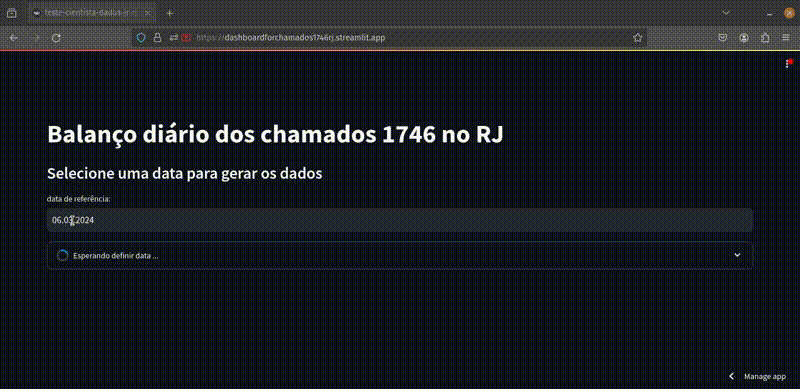

# Dashboard com balanço diário dos chamados 1746 no Rio de Janeiro

Esse repo contém o código para o dashboard com o balanço diário dos chamados 1746 no Rio de Janeiro. A ideia desse trabalho é mostrar uma visão
geral da quantidade de chamados que existiu em um dia e quantos foram atendidos, qual foi os tipos de chamados mais abertos e os bairros com mais ocorrências. Você pode visualizar o projeto nesse [link](https://dashboardforchamados1746rj.streamlit.app/).

## Como o projeto está organizado

### Organização dos arquivos

1. A pasta `src/data` contém os scripts com as querys para adquir os dados para resolução do desafio. 
2. A pasta `src/plot` contém o scripts para construção de gráficos com o dashboard.
3. O arquivo `config.toml` contém algumas variáveis de configuração do dashboard e nome do projeto na GCP.
4. O arquivo `dashboard_app.py` contém o script para rodar o dashboard e foi contruído utilizando a lib `streamlit`
5. A pasta `dataset` armazena os dados adquiridos com os scripts e a pasta `notebooks` contém as análises dos dados para a resolução do desafio.

### Conjunto de Dados

Os conjuntos de dados que serão utilizados neste desafio são:

- **Chamados do 1746:** Dados relacionados a chamados de serviços públicos na cidade do Rio de Janeiro. O caminho da tabela é : `datario.administracao_servicos_publicos.chamado_1746`
- **Bairros do Rio de Janeiro:** Dados sobre os bairros da cidade do Rio de Janeiro - RJ. O caminho da tabela é: `datario.dados_mestres.bairro`

### Como rodar esse projeto localmente?

1. Instale as libs do `requirements.txt` em sua virtual env de preferência. Olhe nesse [link](https://github.com/TalissaMoura/emd-desafio-junior-data-scientist) se quiser um exemplo com o conda.
2. Lembre-se de configurar seu projeto na sua conta GCP. O tutorial para isso está [aqui](https://docs.dados.rio/tutoriais/como-acessar-dados/).
3. Para executar o dashboard execute o comando `streamlit run dashboard_app.py`.
4. Em uma primeira execução, para adquir os dados é necessário se autenticar seu acesso. Basta realizar o login no Pydata com sua conta do google.